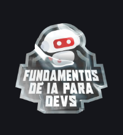
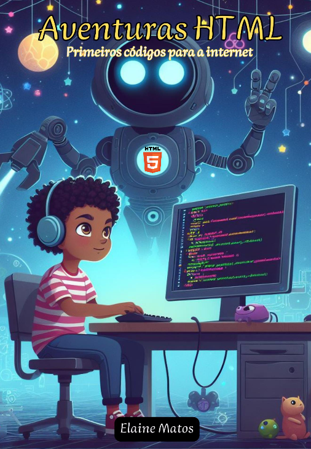

 

      

  ## $${\color{red}Santander \space 2024 \space - \space Fundamentos \space de \space IA \space para \space Devs }$$
 

## ${\color{orange}Projeto \space EBOOK \space \space Gerado \space por \space IAs \space - \space DIO }$
### 🤖 Projeto criado como desafio do curso "Santander 2024 - Fundamentos de IA para Devs" ministrado pelo instrutor Felipe Aguiar, com o objetivo de gerar um ebook digital com as facilidades das ferramentas de IA. 

      
 
  ### $${\color{yellow}Aventuras \space HTML \space  - \space Primeiros \space códigos \space para \space a \space internet }$$

 
### ${\color{lightblue}Esse \space trabalho \space foi \space  criado \space para \space dar \space uma \space breve \space introdução \space ao \space HTML \space para \space crianças \space apartir \space de \space 7 \space anos \space de \space idade.}$  ${\color{lightblue}Não \space visa \space ensiná-los \space a \space desenvolver \space 🌐, \space mas \space despertar \space o \space interesse \space pelo \space desenvolvimento. }$ 

## 💻 Tecnologias utilizadas no projeto
- Bate-papoGPT
- Microsoft Copilot
- Canva
- Power Point

## ✨ Recursos
- Conteúdo gerado via ChatGPT
- Imagens geradas via Microsoft Copilot
- Criação efetuada pelo Canva

